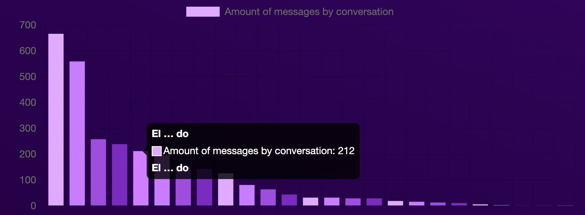

<br>

<p>
  Powered by
  <a href="https://github.com/LinusBolls/signal-plasm">P.L.A.S.M. - Package for Locally Accessing Signal Messages</a>,
  <a href="https://github.com/electron-react-boilerplate/electron-react-boilerplate">Electron React Boilerplate</a>
  , and 
  <a href="https://www.npmjs.com/package/chart.js">Chart.js</a>
</p>

<br>



## How it works

E.C.T.O.P.L.A.S.M. uses P.L.A.S.M. to interact with db.sqlite, the file where Signal Desktop stores (along with some less exciting data) your contacts, messages, and reactions.
This means you'll have to have Signal Desktop installed on your machine or this will not do anything incredibly spectacular ;)

## Install

Clone the repo and install dependencies:

```bash
git clone --depth 1 --branch main https://github.com/LinusBolls/signal-ectoplasm.git your-project-name
cd your-project-name
npm install --force
```

**Having issues installing? See the [Electron React Builerplate debugging guide](https://github.com/electron-react-boilerplate/electron-react-boilerplate/issues/400)**

## Starting Development

Start the app in the `dev` environment:

```bash
npm start
```

## Packaging for Production

To package apps for the local platform:

```bash
npm run package
```

## License

MIT © [E.C.T.O.P.L.A.S.M.](https://github.com/LinusBolls/signal-ectoplasm)